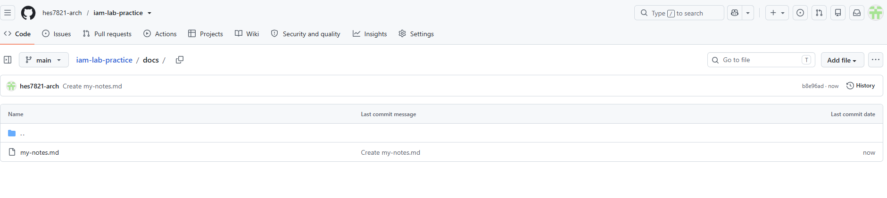

My IAM Lab Practice

This repo is where I practice before doing the real labs.

## What I am learning

- Microsoft Entra ID
- How to publish a project on GitHub

## A thing I want to remember

**Bold text** is done with two asterisks.

Here is a link: [Microsoft Entra documentation](https://learn.microsoft.com/entra/)

# Project Title

## Project Overview

One or two sentences on what this is.

## Business Scenario

The fictional company and what they needed.

## Tools Used

- Microsoft Entra ID

## What I Built

The main sections of work.

## Screenshots

## Security Lessons Learned

What this taught me about why it matters.

## Future Improvements

What I would do next, honestly.
